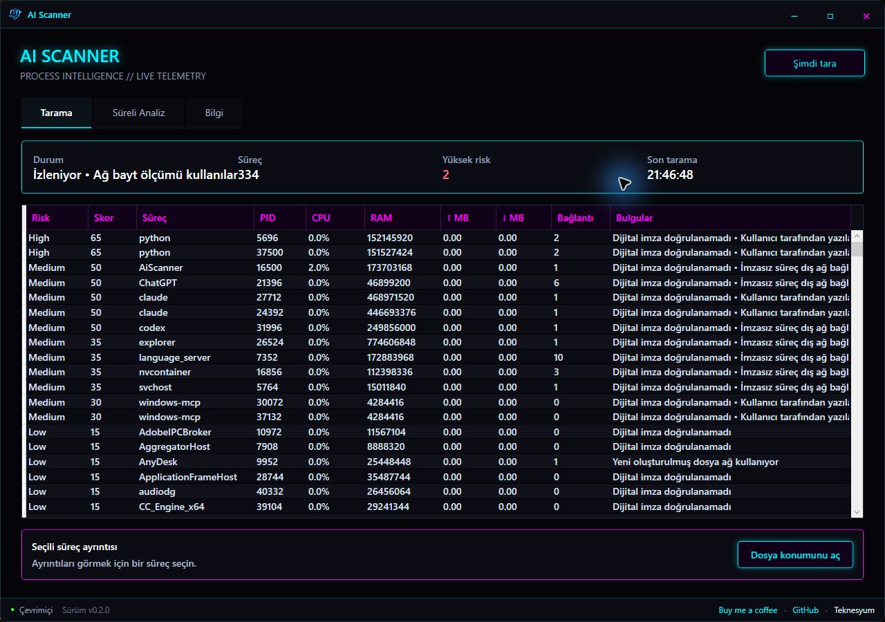

# AI Scanner

Cross-platform process telemetry and AI-assisted threat triage for Windows, Linux, and macOS.

AI Scanner listens to running processes for a selected period, performs the expensive correlation locally, removes low-value noise, stores the evidence on disk, and creates a ready-to-paste prompt for Codex or another AI. The AI interprets a prepared evidence package—it is not asked to collect or invent telemetry.



## Install in one command

The release packages are self-contained; you do **not** need to install .NET or build the source code.

### Windows 10/11 x64

Open **PowerShell**, paste this line, and press Enter:

```powershell
irm https://raw.githubusercontent.com/Teknesyum/AiScanner/main/scripts/install.ps1 | iex
```

The installer downloads the latest release, installs it under `%LOCALAPPDATA%\Programs\AiScanner`, creates an **AI Scanner** desktop shortcut with the application icon, and launches the app. Run PowerShell as Administrator when you want Windows ETW upload/download byte telemetry; the rest of the scanner also works without elevation.

### Linux x64

Open a terminal, paste this line, and press Enter:

```bash
curl -fsSL https://raw.githubusercontent.com/Teknesyum/AiScanner/main/scripts/install-linux.sh | bash
```

The installer places the application in `~/.local/share/AiScanner`, creates the `aiscanner` command and adds **AI Scanner** to the desktop application menu. On a graphical session it launches the app automatically. No `sudo` is required.

If your minimal Linux installation does not already contain desktop libraries, install them once:

```bash
# Ubuntu / Debian
sudo apt update && sudo apt install -y libx11-6 libice6 libsm6 libfontconfig1
```

You can then launch it from the application menu or run:

```bash
aiscanner
```

### macOS — Intel and Apple Silicon

Open **Terminal**, paste this line, and press Enter. The installer automatically selects Intel (`x64`) or Apple Silicon (`arm64`):

```bash
curl -fsSL https://raw.githubusercontent.com/Teknesyum/AiScanner/main/scripts/install-macos.sh | bash
```

The app is installed as `~/Applications/AI Scanner.app` and opened automatically. The current package is not Apple-notarized. If macOS blocks the first launch, open **Finder → Home → Applications**, Control-click **AI Scanner**, choose **Open**, then confirm **Open**. This approval is normally needed only once.

### Updating

Run the same one-line installer again. It downloads the newest GitHub release and replaces the existing installation while keeping locally collected analysis data.

## How to use AI Scanner

### 1. Start the application

Open **AI Scanner** from the desktop shortcut or application menu. Linux users can also run `aiscanner` from a terminal. The app begins monitoring the process list and shows its collector status at the top.

On Windows, launching it as Administrator enables ETW per-process upload/download byte collection. If you launch it normally, process, CPU, memory, file, signature and connection analysis still works; the unavailable network-byte capability is clearly marked instead of being reported as zero traffic.

### 2. Run an instant scan

Open the **Scan** tab and click **Scan now**. The table is refreshed with the currently running processes and ordered by the local risk score.

- Select a row to see its executable path, SHA-256 hash and verified publisher.
- Click **Open file location** to reveal the selected executable in Explorer, Finder or your Linux file manager.
- Review the risk level and primary reason. A high score means “investigate first”, not automatic proof of malware.
- After the scan completes, **Create prompt for analysis** becomes available.

Use an instant scan when you want a quick snapshot. It cannot prove behavior that only becomes visible over time.

### 3. Record behavior over time

Open **Timed Analysis** and choose **1, 5, 10, 20 minutes**, or enter a custom duration and click **Start**. Recording begins at the exact moment you press the button; older telemetry is not mixed into the session.

During recording:

- the **Scan now** control displays `Scanning • MM:SS`;
- the process table continues updating approximately every four seconds;
- CPU, RAM, file identity, active endpoints and available network counters are saved locally;
- wait until the countdown finishes—closing the app cancels the current session.

Suggested durations:

| Duration | Good for |
|---|---|
| 1 minute | quick CPU spikes and immediately active processes |
| 5 minutes | first-pass checks for miners and aggressive background traffic |
| 10–20 minutes | intermittent spyware behavior, periodic uploads and load changes |
| Custom | reproducing a known event, application launch or suspicious scheduled activity |

When recording finishes, AI Scanner correlates observations by executable path and SHA-256, filters stable low-value noise, calculates local findings, and writes a readable report. The prompt button appears only after this local work is complete.

### 4. Create the AI analysis prompt

Click **Create prompt for analysis**. The button changes to **✓ Copied to clipboard** for confirmation. AI Scanner also saves the prompt next to the analysis bundle so the result is not lost if clipboard access fails.

Paste the prompt into Codex or another AI assistant. The prompt tells the AI where the local JSON evidence file is located, how its fields are organized, which platform capabilities were unavailable, and asks for an evidence-based report. If that AI cannot access files on your computer, attach the referenced `analysis-*.json` file manually.

A useful final report should include:

- a prioritized list of suspicious processes and the evidence for each one;
- likely benign explanations and confidence level;
- path, PID and SHA-256 for files that need further inspection;
- safe verification steps before deleting, blocking or terminating anything;
- an explicit note when evidence is insufficient.

### 5. Find saved evidence

Click **Open data folder** in **Timed Analysis**. The folder contains:

- `telemetry.jsonl` — chronological local process snapshots;
- `analysis-*.json` — filtered and correlated evidence for a completed timed session;
- `analysis-*.prompt.txt` — the ready-to-paste AI instruction;
- `instant-analysis-*.prompt.txt` — prompts created from instant scans.

AI Scanner does not upload these files automatically. You decide if and where they are shared.

### Reading results safely

Scores combine several indicators, including sustained CPU load, rapid changes, writable-path execution, recent binaries, unsigned network activity where signature verification exists, PID respawning and unusual network behavior. Normal developer tools, game launchers, backup clients and update services can trigger similar signals.

Do not delete a file solely because it appears near the top. Verify its path and publisher, compare its SHA-256 with a trusted source, scan it with your security product, and only then decide on remediation. If a process disappears when a system monitor opens, reproduce the behavior with a timed recording rather than relying on a single observation.

## What it detects

- CPU and memory behavior over time—not just a single snapshot
- executable path, creation time, SHA-256 identity, and platform signature status
- established remote endpoints attributed to individual processes
- sustained load, sharp CPU changes, recent binaries, writable-path execution, PID respawning, and signature/network combinations
- Windows Task Manager evasion patterns, where high load drops immediately after Task Manager starts
- abnormal upload/download behavior when the platform exposes per-process byte telemetry

Pressing **Scan now** creates an instant evidence set and enables the prompt button. Pressing **1, 5, 10, 20, or custom minutes** starts a new capture at that exact moment. AI Scanner samples throughout the full interval, shows the countdown in the scan control, writes JSONL locally, creates a correlated JSON bundle, and only then enables the AI prompt.

## Platform capabilities

| Capability | Windows | Linux | macOS |
|---|---|---|---|
| Process, CPU, RAM, path, hash | Yes | Yes, subject to `/proc` permissions | Yes, subject to OS permissions |
| Code signature verification | Authenticode chain | Reported unavailable; never treated as unsigned | `codesign --verify` |
| Established TCP endpoints | IP Helper API | `/proc/net/tcp*` + socket inode/PID mapping | `lsof` |
| Per-process upload/download bytes | ETW when elevated | Unavailable without a privileged eBPF collector | Unavailable without an entitled Network Extension |
| Task Manager evasion signal | Yes | Not applicable | Not applicable |

Missing telemetry is recorded as **unavailable**, never as zero activity or evidence of safety.

## Local data and AI workflow

Data is stored under the operating system's local application-data directory in `AiScanner/data`. The generated prompt contains the exact analysis bundle path, explains its schema, marks unavailable capabilities, and asks the AI to produce an evidence-based report. The app never uploads data by itself, kills processes, deletes files, or quarantines software.

AI Scanner is a triage and investigation aid, not a replacement for antivirus/EDR or professional incident response.

## Build from source

Requires the .NET 9 SDK:

```powershell
dotnet test AiScanner.sln -c Release
dotnet run --project src/AiScanner.App/AiScanner.App.csproj
```

Create self-contained Windows x64, Linux x64, macOS x64, and macOS ARM64 archives:

```powershell
./scripts/build-release.ps1 -Version 0.3.4
```

The desktop UI uses [Avalonia](https://avaloniaui.net/). Windows network-byte collection uses ETW; Linux and macOS adapters use native, read-only operating-system sources.

## Privacy and responsible use

- no automatic upload or cloud dependency
- user-profile paths are anonymized in compact AI summaries
- executable metadata is treated as untrusted input
- no destructive remediation actions
- only scan systems you own or are authorized to inspect

## Sponsor

If AI Scanner saves you time, you can support continued development:

[](https://github.com/sponsors/Teknesyum)

## Author and license

Created and maintained by [Teknesyum](https://github.com/Teknesyum). Source code is licensed under the [MIT License](LICENSE).
